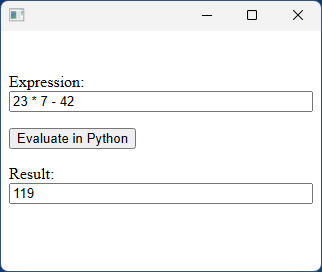
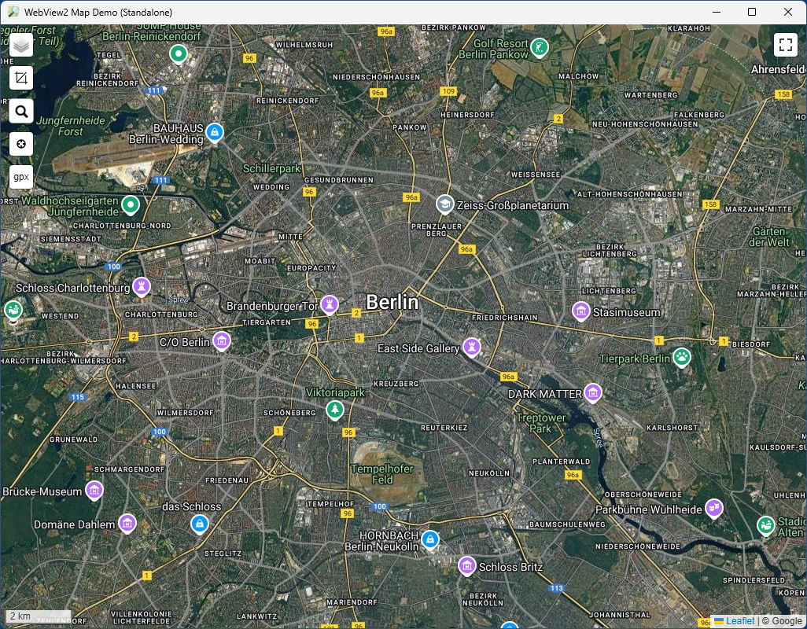

# python-webview2

python-webview2 is a WebView implementation for Python 3.x in Windows 10/11 based on the [MS Edge WebView2 runtime](https://developer.microsoft.com/en-us/microsoft-edge/webview2) (i.e. Chrome/Chromium). It's a lightweight (about 200 KB) alternative for (outdated) [cefpython3](https://pypi.org/project/cefpython3/), since the runtime is preinstalled in any Windows 11 and fully updated Windows 10 system (and can be installed manually in older Windows 10 systems).

python-webview2 is implemented as binary Python extension module (.pyd) and based on this [webview library](https://github.com/webview/webview).

## Installation

Copy the appropriate webview2.cp...-win_....pyd file into the DLLs folder of your local Python installation, done.

## Examples

*The [examples](examples/) folder also contains demos for using python-webview2 with [wxWidgets](https://pypi.org/project/wxPython/) or with the plain [WinAPI](https://en.wikipedia.org/wiki/Windows_API) and [ctypes](https://en.wikipedia.org/wiki/Windows_API).*

### 1.) Binding: Call from JS into Python, return result to JS
```python
import webview2

webview = webview2.WebView()
webview.set_html('''
<br>
<p>
  <label for="inp">Expression:</label>
  <input id="inp" value="23 * 7 - 42" style="width: 100%">
</p>
<p><button id="btn">Evaluate in Python</button></p>
<p>
  <label for="res">Result:</label>
  <input id="res" style="width: 100%">
</p>
<script>
document.getElementById('btn').addEventListener("click", async () => {
    document.getElementById('res').value = await __py_eval__(document.getElementById('inp').value);
});
</script>
''')

def python_eval(id, args):
    try:
        expression = eval(args)[0]  # quick & dirty, better use json.loads
        webview.js_return(id, 0, str(eval(expression)))
    except Exception as e:
        webview.js_return(id, 0, f'"Error: {e}"')  # quick & dirty, better use json.dumps

webview.js_bind("__py_eval__", python_eval)
webview.run()
```


### 2.) Minimal Map Viewer Demo (Standalone)
```python
import os
import webview2

APP_DIR = os.path.dirname(os.path.realpath(__file__))

webview = webview2.WebView(
    width = 1024, height = 768,
    icon = os.path.join(APP_DIR, "resources", "main.ico"),
    title = "WebView2 Map Demo (Standalone)",
    url = "https://59de44955ebd.github.io/map/",
    debug = True,
)
webview.js_bind("__on_fs__", lambda id, args: webview.set_fullscreen(eval(args)[0]))
webview.js_eval("""
document.addEventListener(
    'fullscreenchange', 
    () => __on_fs__(+!map._isFullscreen)
)
""")
webview.run()
```


### 3.) Minimal Map Viewer Demo ([PyQt5](https://pypi.org/project/PyQt5/), [PyQt6](https://pypi.org/project/PyQt6/) or [PySide6](https://pypi.org/project/PySide6/))
```python
import os
import webview2

from PyQt5.QtWidgets import QApplication, QMainWindow
# from PyQt6.QtWidgets import QApplication, QMainWindow
# from PySide6.QtWidgets import QApplication, QMainWindow

APP_DIR = os.path.dirname(os.path.realpath(__file__))


class Main(QMainWindow):

    def __init__(self):
        super().__init__()
        self.webview = webview2.WebView(
            window = int(self.winId()),
            autosize = True,
            icon = os.path.join(APP_DIR, "resources", "main.ico"),
            title = "WebView2 Map Demo (PyQt/PySide)",
            url = "https://59de44955ebd.github.io/map/",
            debug = True,
        )
        self.webview.js_bind("__on_fs__", 
                lambda id, args: self.webview.set_fullscreen(eval(args)[0]))
        self.webview.js_eval("""
        document.addEventListener(
            'fullscreenchange', 
            () => __on_fs__(+!map._isFullscreen)
        )
        """)
        self.resize(1024, 768)
        self.show()

    def closeEvent(self, e):
        self.webview.terminate()

    def run(self):
        self.webview.run()

if __name__ == "__main__":
    app = QApplication([])
    main = Main()
    main.run()
```

## API

```
webview2.WebView(autosize=False, debug=False, height=240, icon=None, title=None, url=None, width=320, window=None)
```
Constructor, create a WebView instance, either as standalone window or embedded into an existing window.  
Parameters:
* autosize (bool) - Embedded mode only: If True, WebView resizes automatically to the parent window's client rect
* debug (bool) - If True, the DevTools (Console etc.) are available (F12)  
* height (int) - Initial height of the WebView
* icon (str) - Standalone mode only: path to .ico file used as window icon
* title (str) - Standalone mode only: window title
* url (str) - URL to load (same as calling navigate(url))
* width (int) - Initial width of the WebView
* window (int): - Handle (HWND) of existing window in which WebView is embedded
  
```
<instance>.get_native_handle(kind)
```
Get a native handle (HWND) of choice.  
Parameters:
* kind (int) - See constants

```
<instance>.js_bind(name, fn)
```
Bind a function pointer to a new global JavaScript function.  
Parameters:
* name (str) - Name of the JS function.  
* fn (function) - Callback function  

```
<instance>.js_eval(js)
```
Evaluate arbitrary JavaScript code. Use bindings if you need to communicate the result of the evaluation.  
Parameters:
* js (str) - The JavaScript code to evaluate

```
<instance>.js_init(js)
```
Inject JavaScript code to be executed immediately upon loading a page. The code will be executed before window.onload.  
Parameters:
* js (str) - The JavaScript code to inject

```
<instance>.js_return(id, status, result)
```
Respond to a binding call from the JS side.  
Parameters:  
* id (str) - The identifier of the binding call.Pass along the value received in the binding handler(see webview_bind()).   
* status (int)  -- A status of zero tells the JS side that the binding call was successful; any other value indicates an error.  
* result (str)  - The result of the binding call to be returned to the JS side. This must either be a valid JSON value or an empty string for the primitive JS value undefined.

```
<instance>.js_unbind(name)
```
Remove a binding created with bind().  
Parameters:
* name (str) - Name of the JS function. 

```
<instance>.navigate(url)
```
Navigate webview to the given URL. URL may be a properly encoded data URI.  
Parameters:
* url (str)

```
<instance>.run()
```
Run the main loop until it's terminated.  

```
<instance>.set_focus()
```
Set/restore mouse scroll and keyboard focus to webview.  

```
<instance>.set_fullscreen(fullscreen)
```
Enter/leave fullscreen mode.
Parameters:
* fullscreen (bool)

```
<instance>.set_html(html)
```
Load HTML content into the webview.
Parameters:  
* html (str)

```
<instance>.set_size(width, height, hint=0)
```
Update the size of the WebView.  
Parameters:
* width (int) - New width.  
* height (int) - New height.  
* hint (int) - Size hint (see constants)

```
<instance>.set_title(title)
```
Update the title of the native window.   
Parameters:
* title (str)

```
<instance>.terminate()
```
Stop the main loop.

### Constants
Window size hints  
* webview2.HINT_NONE = 0  
* webview2.HINT_MIN = 1  
* webview2.HINT_MAX = 2  
* webview2.HINT_FIXED = 3  

Native handle kind.   
* webview2.NATIVE_HANDLE_KIND_UI_WINDOW = 0  
* webview2.NATIVE_HANDLE_KIND_UI_WIDGET = 1  

## Compiling

Compiling the Python extension module (.pyd) requires MS Visual Studio 2017 or later, and the environment variable %PYTHONHOME% must be set and contain the full path to a Python 3.x for Windows installation with "include" and "libs" subfolders.
